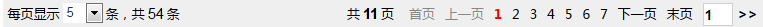

# EasyDataTable AJAX分页插件使用手册

说明：该插件与DataTable插件为同一插件，是DataTable的中文版本，提示消息和使用手册均为中文版。  
Notice：It's same to DataTable,This plugin is DataTable the Chinese version, the English version please refer to：https://github.com/ushelp/DataTable

使用Ajax分页可以提高数据加载和显示速度，减少网络流量，提升客户体验度；同时能够只刷新局部，解决当页面上有多个数据显示表格区域时，传统的分页方式会导致页面全部刷新。   

EasyDataTable AJAX分页插件是基于jQuery最好的纯Ajax分页插件，支持HTML增强和JS编程两种途径实现分页，最大的特点是：简单、易用、灵活。支持多种数据源加载（服务器动态数据源，静态数据源，JSON文件数据源）；自带分页标签；支持自定义分页；自定义Loading提示；数据表格UI可自定义；支持列点击排序，支持静态数据排序；支持条件动态查询，静态数据条件筛选查询，支持范围、方式及模式支持，内置8种静态数据查询匹配模式；内置EasyDataTable表达式语言、事件支持，能够通过JavaScript编程增强分页。

**兼容性**：EasyDataTable完全兼容IE6及以上版本、Firefox、Chrome、Safari、Opera等各内核（Trident、Gecko、Webkit、Presto）浏览器，并兼容多平台及系统（PC，TabletPC，Mobile）。

与Ext等比较EasyDataTable的主要特点：   
1. 轻量： EasyDataTable需要更少的资源加载，非常 **轻量级**    
2. 易用： **HTML增强支持** ，几乎无需JS代码，全面封装，简单易用，JS零编程即可实现强大的Ajax分页功能     
3. 灵活： 不受限制，自带表达式语言，事件支持，从UI到功能实现均可 **灵活自定义** 和扩展     
4. 全面： 动态，静态**多种数据源加载**全面支持，并支持多种不同范围、方式、模式的静态数据筛选查询

> EasyDataTable目前支持两个版本 1.X 和 2.X 版本   
> 2.X 增加了对静态数据源、JSON文件数据源的分页加载支持，并支持对以上静态数据进行筛选查询和排序。

----------

## 1、引入EasyDataTable核心js和css文件
	
	<link rel="stylesheet" href="css/datatable.css" type="text/css" />
	
	

## 2、分页表格结构

EasyDataTable的结构分为表单、EasyDataTable数据表格（表头行，数据展示行）、分页div三个部分，按照如下结构创建数据表格：

	<!-- 创建表单 action值为分页处理的动态请求地址 -->
	<form action="服务器分页地址">
	
		<!--  EasyDataTable 数据展示表格，必须有id  -->
		<table id="表格id">

			<!--  表头行  -->
			<tr><th></th>    …… </tr>

			<!--  数据展示行  -->
			<tr style="display: none;"><td></td>    …… </tr>

		</table>
		
		<!--  分页行  -->
		
	

	
	</form>

### 分页表格实例：

	<!-- 创建表单 action值为分页处理的请求地址 -->
	<form action="doPage.jsp" name="myform">
	    <!-- 使用DIV来包装EasyDataTable 数据展示表格，当数据超出DIV高度时，可现实滚动条 -->
	   	

	  			<!--显示数据的表格，必须指定id，EasyDatatable通过id初始化分页数据-->
			    <table class="datatable"  id="datatable"  width="100%" align="center">
	            	<!--表头行-->
			      	<tr>
			      		<th width="40">
							<!-- 调用DataTable.checkAll(this,'复选框名称')函数或使用HTML增强添加check="复选框名称"属性，均可可实现复选框全选/全不选功能 -->
							<input type="checkbox" onclick="DataTable.checkAll(this,'mychk')" />
				   		</th>
				   		<th width="80">数量</th>
				   		<th width="100">编号</th>
				   		<th width="100">姓名</th>
				   		<th width="100">信息</th>
				   		<th >操作</th>
			   		</tr> 
					<!-- 数据展示行，使用 {属性} 属性表达式获取数据 -->
				   	<tr  style="display: none;">
				   		<td style="text-align:center;height: 45px;">
	            			<!--自定义复选框,value为对象的id-->
				   			<input type="checkbox" name="mychk" value="{id }"/>
				   		</td>
	            		<!--使用内置的datatableCount属性，显示数据条数-->
				   		<td align="center"  style="text-align:center;height: 45px;">
							{datatableCount }
						</td>
				   		<td style="text-align:center;color:#00f">No.{id}</td>
				   		<td align="center">{name}</td>
				   		<td>{info}</td>
				   		<td align="center" style="width: 120px">
				   			<a href="doUser.jsp?o=show&id={id }">查看</a>
					   		<a href="doUser.jsp?o=edit&id={id }">修改</a>
					   		<a href="doUser.jsp?o=delete&id={id }">删除</a>
					   	</td>
				   	</tr>
			   </table>
	    

		<!--分页标签部分，使用size属性设置每页显示条数下拉菜单可选值，使用,分隔-->
	    

		

	</form>

## 3、对Ajax分页表格进行数据初始化

EasyDataTable支持HTMl增强和JS两种方式实现分页表格的初始化。

### 3.1、方法一：html增强，使用easydatatable类样式   

给表格添加`easydatatable`类样式进行初始化（表格必须有id）

	<table class="datatable easydatatable" id="datatable3" width="780px" align="center">

### 3.2、方法二：JavaScript，使用 DataTable.load() 函数

使用 `DataTable.load( 表格id，参数信息) `函数对要进行Ajax分页的表格进行初始化   
**`DataTable.load( tableid [，easydataParameters] );`**

参数说明：   
`tableid`：必须参数，显示数据的表格id  
`easydataParameters`：可选参数，指定**EasyDataTable的初始化分页参数**信息，支持的参数 :  
	{  
		`pagetheme`: '分页主题',  
		`loading`: '分页加载数据时，Loading提示的方式',  
		`language`: '分页标签的语言',  
		`start`: '数据开始加载事件处理函数',  
		`end`: '数据结束加载事件处理函数',  
		`row`: '初始每页加载显示数量'  
	}

#### easydataParameters 初始化分页参数说明 

- #### pagetheme——可选，分页标签主题
支持两套可选分页主题，及自定义分页（值不区分大小写）

	`"FULL"`（完全主题，默认显示所有分页选项，默认值）
	
 
	`"SIMPLE"` (简单主题，不显示快速跳转页码) 
	
	 
	`"NO"` (取消主题，使用自定义分页，参考第11章节《自定义分页》)
	
	**该参数支持HTML增强：**     
	`pagetheme`参数也可通`分页div`的`pagetheme属性`设置。加载顺序为html、javascript，后加载的参数会覆盖前面的值，参考第10章节《分页主题设置》。

- #### loading——可选，分页加载数据时Loading方式
	
	由于Ajax程序在执行过程中并不刷新网页，所以在执行分页等操作时，Ajax应用应当当给客户给出相应加载执行的提示和反馈，否则用户可能会认为任务未执行或失败，影响体验度。

    EasyDataTable在分页加载时支持进行Loading配置，可选值为：`"default"`、`"show"`、`"none"`、`"hide"`或`"任意值"`。（值不区分大小写）

	`"default"`: 默认值，分页加载时禁用表格操作(禁用超链，按钮)，数据显示为灰色
	 
	`"show"`: 显示文字加载提示，分页加载时显示DataTable.loading_msg定义的loading提示内容（可修改）"数据正在读取中……"
	 
	`"none"`: 隐藏数据展示行，分页加载时隐藏数据展示行的数据+单元格，显示完全为空白

	`"hide"`: 隐藏数据内容，分页加载时仅隐藏数据展示行的数据，保留显示单元格边框
	 
	`"任意值"`：直接将该内容作为分页加载时提示内容（等同show方式），支持HTML内容

	示例：

		loading:"
 数据正在加载中……
"  

	**该参数支持HTML增强：**     
   
	`loading`参数也可通过数据`表格的loading属性`设置。加载顺序为html、javascript，后加载的参数会覆盖前面的值。

- #### language——可选,设置分页标签显示的语言
 
	默认分页配置定义在`DataTable.default_lang`属性中，默认值为：

		DataTable.default_lang={
		      first:"首页",
		      previous:"上一页",
		      next:"下一页",
		      last:"末页",
		      totalCount:"共{0}条",
		      totalPage:"共{0}页",
		      rowPerPage:"每页显示{0}条"
		}

	可直接修改和重新定义该属性的值作为全局默认分页文字和语言。    
	也可根据需要在初始化参数中为指定数据表格重新定义分页语言，`{0}`为显示相应数据的占位符,必须存在。

		  

- #### start——可选,设置每一次数据加载开始时的处理函数
 
		/*
		o：当前表格对象
		initFlag：true代表第一次加载数据（初始化表格），false代表分页加载
		*/
		"start":function(o,initFlag){ 
		  			if(initFlag){ //第一次加载（未初始化）
		  				console.info('init start...');
		  			}else{ 
			  			console.info('load start...');
		  			}
		  		}

- #### end——可选,设置每一次数据加载结束时的处理函数

		/*
		o：当前表格对象
		initFlag：true代表第一次加载数据（初始化表格），false代表分页加载
		*/
		"end":function(o,initFlag){ 
		  		if(initFlag){ //第一次加载（未初始化）
		  			console.info('init end...');
		  		}else{ 
			  		console.info('load end...');
		  		}		
		  	}

- #### row——可选,设置初始分页加载的条数
 
	在初始化参数中指定默认分页加载的数据条数。如不设置该参数，将使用`DataTable.default_row`属性的值默认值5（可修改）。
     
	**该参数支持HTML增强：**   
	row参数也可通过`分页div`的`row属性`设置，加载顺序为html、javascript，后加载的参数会覆盖前面的值。

## 4、EasyDataTable Expression Language 表达式语言使用

### 4.1 EasyDataTable Property Expression 属性表达式  `{数据属性}`
**属性表达式用于在数据展示行，显示指定的属性值。**    
在属性表达式中可以直接引用数据属性来获得指定属性的数据。并支持各种数学、比较等JavaScript基本运算符进行运算。    

	{id}    {name}

### 4.2 EasyDataTable Statement Expression 语句表达式 `%{表达式语句}%`
**语句表达式用于在数据展示行，使用编程语句进行控制编程。**   
在语句表达式中支持使用JavaScript编写表达式代码；支持直接调用数据属性；也支持使用EasyDataTable属性表达式（必须使用引号定义在字符串中使用）。   
语句表达式执行的结果必须使用EasyDataTable语句表达式标准输出方法输出：    **`DataTable.out("内容");`**

	<%--
	支持JavaScript语言编写表达式。
	属性名：以变量方式引用和处理
	EasyDataTable属性表达式：必须使用引号定义在字符串中使用
	--%>
	%{
		var res=name+"   {name}";
		DataTable.out(res);   
	}% 
					   		
	%{ 
		if(id%2==0){ 
			var op='<a href="doUser.jsp?o=show&id='+id+'">查看</a>&nbsp;&nbsp;'; 
			op+='<a href="doUser.jsp?o=edit&id={id }">修改</a>';
			
			DataTable.out(op);  
		}else{ 
			 DataTable.out('<a href="doUser.jsp?o=show&id={id }">查看</a>&nbsp;&nbsp;<a href="doUser.jsp?o=edit&id={id }">修改</a>&nbsp;&nbsp;<a href="doUser.jsp?o=delete&id={id }">删除</a>');  
		} 
	}%

## 5、EasyDataTable内置数据属性
**EasyDataTable内置了与数据及分页相关的内置属性，可在数据展示行或分页标签行直接使用。**

**仅在数据展示行有效：**    
`datatableIndex`：可获得数据在当前页的索引    
`datatableCount`：可获得数据在当前页的个数    
`key`：Map数据集合时可用来获取数据对于的键    

**数据展示行、分页标签均可使用：**   
`pageNo`：当前页   
`maxPage`：总页数    
`rowPerPage`：每页显示条数    
`totalCount`：数据总条数    
`sort`：排序字段    
`order`：排序方式，`desc`或`asc`    

**例如：**   
当前数据在所有数据中的索引：`{datatableIndex+(pageNo-1)*rowPerPage}  `  
当前数据在所有数据中的个数：`{datatableCount+(pageNo-1)*rowPerPage}`

## 6、排序支持
在表头行需要排序字段对应的单元格上添加`sort="排序字段名称"`属性即可。

	<tr>
		<th width="80">count</th>
		<th width="80">index</th>
		<th width="80">{index+1}</th>
		<th width="100" sort="id">id</th>
		<th width="100" sort="name">name</th>
		<th width="100" sort="info">info</th>
		<th >操作</th>
	</tr>
 
可排序列会显示排序箭头。点击即可发送服务器需要的排序信息：排序字段sort（sort的值）和排序方式order(asc或desc)到服务器。    
服务器接收并处理后返回新数据即可实现升序降序切换。
 
服务器端通过order和sort参数名获取排序信息。    

	String sort = request.getParameter("sort");
	String order = request.getParameter("order");

**刷新表格：**  
使用`DataTable.reload(‘tableid’);`可以刷新指定数据表格，恢复到没有排序状态。

	
刷新

### 排序指示符号自定义

EasyDataTable对于可排序的列在外观上通过**排序指示符号**来进行排序提醒。默认在可排序列名上使用上下箭头↑↓（`&uarr;&darr;`）表示该列可进行点击排序；当升序时显示↑（`&uarr;`），降序时显示↓（`&darr;`）来指示当前的升降序方式。

EasyDataTable支持对可排序列的排序指示符号进行**全局**和**按DataTableID**两种方式的的自定义：

**1. 全局自定义：默认修改所有DataTable对象的排序指示符**

- `DataTable.order_default` 可排序列的默认指示符号
- `DataTable.order_up` 可排序列的升序指示符号
- `DataTable.order_down` 可排序列的降序指示符号

	//重新定义EasyDataTable的排序指示符号
	DataTable.order_default="";
	DataTable.order_up="";
	DataTable.order_down="";
	
**2. 按DataTableID自定义：仅修改当前DataTableID对应的DataTable对象的排序指示符**

`DataTable.sort["DataTableID列表"]`可以同时为指定的多个DataTable表格对象设置排序指示符，多个DataTable表格id使用逗号`,`分隔

	DataTable.sort["datatable,datatable2,datatable4"]={
		order_default:"",
		order_up:"",
		order_down:""
	};

## 7、服务器端数据要求    

**EasyDataTable可以自动解析服务器端返回的JSON结果，并实现分页。**  

- **服务器端必须输出如下名称的分页JSON结果：**    
	`data`：数据集合，支持List和Map集合（内置属性key可获取Map的键，Map的值无需使用value前缀）对于的JSON集合
	`pageNo`：当前第几页，数字    
	`rowPerPage`：每页显示条数，数字    
	`totalCount`：数据总条数，数字   
	可选参数：   
	`[sort]`：排序字段   
	`[order]`：排序方式，desc或asc     

- **如果服务器端分页参数封装在PageBean中，如：** 

		public class PageBean {
			private List data;
			private int pageNo;
			private int rowPerPage;
			private int totalCount;
		   //setters&getters ……
		}

	例如，服务器端返输出的JSON对象中PageBean名称为`pb`，则在数据表格`table标签`上加入`value`属性，指定分页对象的JSON名称`pb`：

		<table class="datatable" id="datatable3"  width="780px" align="center" value="pb">

## 8、刷新指定数据表格

	DataTable.reload(“tableId”);  //取消排序效果，刷新表格，重新加载数据

## 9、默认分页条数设置

在**初始化分页参数**中使用`row参数`可以指定默认的分页条数。如果不设置该参数，将使用`DataTable.default_row`属性的值默认值5（可修改）。

`row属性`同时支持在分页div标签中使用HTML增强：
    
	

				
	

## 10、分页主题设置

DataTable内置分页实现，并提供了两套主题：

`FULL`（完全主题，默认显示所有分页选项，默认值）

	 
`SIMPLE` (简单主题，不显示快速跳转页码)

 
### 10.1、使用JavaScript指定分页主题

	DataTable.load("datatable",{
	  	"pagetheme":'SIMPLE'
	 });

### 10.2、在分页DIV标签上指定分页主题

	

	
	

### 10.3、取消分页和主题

使用display:none隐藏，或直接删除分页标签部分即可。

	

## 11、自定义分页
EasyDataTable支持分页的自定义，在分页div标签中可编写自定义分页代码。自定义分页代码中支持使用：EasyDataTable内置属性、属性表达式和语句表达式。

为 `分页div标签` 添加 `pagetheme="no"` 属性（或通过EasyDataTable初始化参数设置），调用**`DataTable.go('加载数据的表格id','页数',[每页显示条数]) `**函数，即可实现自定义分页跳转。    
也可使用`row`属性指定默认每页显示条数：

	

实例：

	

		当前第{pageNo}页/共{maxPage}页 每页{rowPerPage}条/共{totalCount}条	
		<input type="button" value="首页" onclick="DataTable.go('datatable7',1)"/>
		<input type="button" value="上一页" onclick="DataTable.go('datatable7', '{pageNo-1}')"/>
		<input type="button" value="下一页" onclick="DataTable.go('datatable7', '{pageNo+1}')"/>
		<input type="button" value="末页" onclick="DataTable.go('datatable7', '{maxPage}')"/>
	

在JavaScript函数调用时，如果参数使用了EasyDataTable属性表达式（如页数`{pageNo-1}`）则需要通过单引号引起来，作为一个字符串参数，否则IE8下会有警告（不影响实际运行结果）。   
例如下面代码中的'{pageNo-1}'必须使用引号：

	onclick="DataTable.go('datatable7', '{pageNo-1}')"/>。

## 12、带搜索条件分页

将搜索框放入form表单中，通过以下两种方式实现带搜索提交分页。

**搜索按钮提交搜索数据的两种方法**

方法一：使用HTML增强，将搜索按钮放入当前表单，给搜索按钮直接加`data_search`类样式

	<input type="button" class="data_search" value="立即查询"/>

方法二：使用`DataTable.load('数据表格id')`，通过单击事件注册给搜索按钮

	<input type="button" class="btn_test" onclick="DataTable.load('DataTableID')" value="立即查询"/>

服务器端即可获取客户端提交的搜索条件。

## 13、EasyDataTable多数据源加载支持

**EasyDataTable支持3种数据源：**  
1. 服务器动态数据源（1.X，2.X支持）       
2. 静态数据源（2.X支持）   
3. 文件数据源（2.X支持）    

_注意：EasyDataTable目前支持 1.X 和 2.X 两个版本。EasyDataTable 1.X仅支持动态数据源的加载；EasyDataTable 2.X还支持静态数据源和文件数据源加载。_

### 13.1、 服务器动态数据源（1.X，2.X）
**在form的action中指定服务器端分页地址**来动态获取JSON分页数据，实现分页。
	
	DataTable.load( 'tableid' [，easydataParameters] );

### 13.2、 静态数据源（2.X）
支持直接加载指定的**JSON数据对象**，实现分页。  
 
    DataTable.staticLoad('tableid' , jsonDataObject [,easydataParams]);

### 13.3、 文件数据源（2.X）
支持直接加载指定的**JSON数据文件**，实现分页。   
 
    DataTable.fileLoad('tableid' , 'jsonFile' [,easydataParams]);

## 14、静态排序支持（2.X）

EasyDataTable支持对静态数据进行排序，在表头行需要排序字段对应的单元格上添加`staticSort="排序字段名称"`属性即可。

	<th width="100" staticSort="id">id</th>
	<th width="100" staticSort="name">name</th>

## 15、静态筛选查询（2.X）

**EasyDataTable支持对静态数据进行筛选查询，并具有以下三大特性：**

1. **查询范围**：支持对All(全部静态数据)和NowPage(当前页的静态数据)两种范围的静态数据筛选查询。

2. **查询方式**：支持多条件筛选时按 `AND` 或 `OR` 方式实现数据筛选。

3. **查询模式**：内置8种MatchMode(查询匹配模式)支持，每个筛选表单项均可独立配置MatchMode。 
	
	 **EasyDataTable支持的8种MatchMode查询匹配模式名称和作用：**
		
		extra：完全匹配    
		extra_i：完全匹配，并忽略大小写 

		like：模糊匹配
		like_i：模糊匹配，并忽略大小写

		sql：SQL通配符匹配（支持百分号`%`通配符，匹配任意字符；支持下划线`_`通配符，匹配单个字符；支持`[0-9]`、`[A-Z]`、`[a-z]`、`[0-9A-Za-z]`等范围通配符，匹配单个字符范围）    
		sql_i：SQL通配符匹配，并忽略大小写

		reg：正则表达式匹配     
		reg_i：正则表达匹配 ，并忽略大小写

###为表单元素指定MatchMode（查询匹配模式）：###
EasyDataTable通过8种数据查询匹配模式MatchMode，为使用者提供了全方位的查询支持；同时支持为每个表单选项独立指定不同的查询匹配模式，极大的增强了筛选的灵活性。

**使用方法：**
使用HTML增强，在相应文本框上添加`mode`属性，并将值指定为EasyDataTable支持的`MathMode名称`即可。

	username： 
	<input type="text" name="name" class="txt_test" mode="sql_i"/> 

	userinfo：
	<input type="text" name="info" class="txt_test" mode="extra"/>
	
默认匹配模式说明：如果没有为表单元素指定`mode`属性，则按**`like_i`(忽略大小写的模糊匹配)**处理，默认匹配模式可通过`DataTable.default_matchMode='like_i'`修改。

###静态数据筛选查询两种范围：###

1. **NowPage**——当前页面数据范围的数据筛选查询：查询当前页面符合条件的数据（同时支持对动态数据源和静态数据源进行NowPage筛选）

2. **All**——全部静态数据范围的数据筛选查询：查询加载的所有静态数据中符合条件的数据（仅支持对静态数据源进行All筛选）

###实现数据筛选的两种方法：###

**方法一：使用HTML增强**

NowPage当前页面静态数据范围的数据筛选查询：给搜索按钮添加`static_data_search[_or]`类样式：

	`data_static_search` 支持多条件的 AND 方式查询。
	
		<input type="button" class="data_static_search" value="static search and" />
	
	`data_static_search_or` 支持多条件的 OR 方式查询。
	
		<input type="button" class="data_static_search_or" value="static search or"/>

ALL全部静态数据范围的数据筛选查询：给搜索按钮添加`static_data_searchAll[_or]`类样式：

	`data_static_searchAll` 支持多条件的 AND 方式查询。
	
		<input type="button" class="data_static_search" value="static searchAll and" />
	
	`data_static_searchAll_or` 支持多条件的 OR 方式查询。
	
		<input type="button" class="data_static_searchAll_or" value="static searchAll or"/>

**方法二：使用内置函数实现静态筛选：**   

NowPage当前页面静态数据范围的数据筛选查询：`DataTable.staticSearch('tableid' [,true] )`

	如果第二个参数为true，则按 OR 方式查询；否则按 AND 方式查询。

	<input type="button" value="static searchAll" onclick="DataTable.staticSearch('datatableStatic')"/>

ALL全部静态数据范围的数据筛选查询：`DataTable.staticSearchAll('tableid' [,true] )`

	如果第二个参数为true，则按 OR 方式查询；否则按 AND 方式查询。

	<input type="button" value="static searchAll" onclick="DataTable.staticSearchAll('datatableStatic')"/>

## 16、表格AJAX分页实例

### 16.1、默认FULL分页主题 + 复选框 + index，count内置属性使用 

	<form action="zh_CN/doPage2.jsp" name="myform">
		

			<table class="datatable easydatatable" id="datatable" width="100%" align="center">
				<tr>
					<!-- checkbox -->
					<th width="40"><input type="checkbox" onclick="DataTable.checkAll(this,'mychk')" /> <!-- CheckAll -->
					</th>
					<!-- datatableIndex,datatableCount -->
					<th width="80">count</th>
					<th width="80">index</th>
					<th width="80">{index+1}</th>
					<th width="100">id</th>
					<th width="100" sort="name">name</th>
					<th width="100" sort="info">info</th>
					<th>operation</th>
				</tr>
				<!-- Data Show Row-->

				<tr style="display: none;">
					<td style="text-align:center;height: 45px;"><input type="checkbox" name="mychk" value="{id }" /></td>
					<td align="center">{datatableCount }</td>
					<td align="center">{datatableIndex }</td>
					<td align="center">{datatableIndex+1 }</td>
					<td style="text-align:center;color:#00f">No.{id}</td>
					<td align="center">{name}</td>
					<td>{info}</td>
					<td align="center"><a href="doUser.jsp?o=show&id={id }">show</a> <a
						href="doUser.jsp?o=edit&id={id }">edit</a> <a href="doUser.jsp?o=delete&id={id }">delete</a></td>
				</tr>
			</table>
		

		

	</form>

### 16.2、指定分页主题SIMPLE + Loading="show" + 带复选框 + 排序属性

	

	<form action="zh_CN/doPage_slow.jsp" name="myform">
			

				<table class="datatable" value="pb" id="datatable2" width="100%" align="center">
					<tr>
						<!-- checkbox -->
						<th width="40"><input type="checkbox" check="mychk" /> <!-- CheckAll --></th>
						<!-- datatableIndex,datatableCount -->
						<th width="80">count</th>
						<th width="100">id</th>
						<th width="100" sort="name">name</th>
						<th width="100" sort="info">info</th>
						<th width="100" >sort、order</th>
						<th>operation</th>
					</tr>
					<!-- Data Show Row-->

					<tr style="display: none;">
						<td style="text-align:center;height: 45px;"><input type="checkbox" name="mychk" value="{id }" /></td>
						<td align="center">{datatableCount }</td>
						<td style="text-align:center;color:#00f">No.{id}</td>
						<td align="center">{name}</td>
						<td>{info}</td>
						<td>
						sort={sort} 
						order={order}
						
						</td>
						<td align="center"><a href="doUser.jsp?o=show&id={id }">show</a> <a
							href="doUser.jsp?o=edit&id={id }">edit</a> <a href="doUser.jsp?o=delete&id={id }">delete</a></td>
					</tr>
				</table>
			

			

		</form>

### 16.3、判断语句DataTable表达式使用 + loading="none" + 默认每页10条

    <form action="zh_CN/doPage2.jsp" name="myform">
    	

		     <table class="datatable easydatatable" loading="none" id="datatable3"  width="100%" align="center">
		      	<tr>
			   	<!-- checkbox -->
			   		<th width="40">
			   			<input type="checkbox"  check="mychk"  /> <!-- CheckAll -->
			   		</th>
			   	<!-- datatableIndex,datatableCount -->
			   		<th width="80">count</th>
			   	   	<th width="80">index</th>
			   	   	<th width="80">{index+1}</th>
			   		<th width="100">id</th>
			   		<th width="100">name</th>
			   		<th width="100">info</th>
			   		<th >operation</th>
		   		</tr> 
		   		<!-- Data Show Row-->
		
			   	<tr style="display: none;">
			   		<td style="text-align:center;height: 45px;">
			   			<input type="checkbox" name="mychk" value="{id }"/>
			   		</td>
			   		<td align="center"> {datatableCount+(pageNo-1)*rowPerPage}</td>
			   		<td align="center"> {datatableIndex+(pageNo-1)*rowPerPage}</td>
			   		<td align="center">{datatableIndex+(pageNo-1)*rowPerPage+1}</td>
			   		<td style="text-align:center;color:#00f">No.{id}</td>
			   		<td align="center">{name}</td>
			   		<td>{info}</td>
			   		<td align="center">
			   		<!-- DataTable 表达式 -->
			   		%{ 
				   		if(id%2==0){ 
				   			var op='<a href="doUser.jsp?o=show&id='+id+'">show</a>&nbsp;&nbsp;'; 
				   			op+='<a href="doUser.jsp?o=edit&id={id }">edit</a>';
				   			DataTable.out(op); 
				   		}else{ 
				   			DataTable.out('<a href="doUser.jsp?o=show&id={id }">show</a>&nbsp;&nbsp;<a href="doUser.jsp?o=edit&id={id }">edit</a>&nbsp;&nbsp;<a href="doUser.jsp?o=delete&id={id }">delete</a>');  
				   		} 
			   		 }%
			   		
			   	
				   	</td>
			   	</tr>
		   </table>
    

      	

			
		

      </form>

### 16.4、带start和end数据加载事件处理函数的分页 + 自定义排序指示符

	

	<form action="zh_CN/doPage_slow.jsp" name="myform">
		<!-- loading提示DIV,第一次加载数据时显示 -->
		

			 数据正在加载中……
		

		

			<table class="datatable" id="datatable4" width="100%" align="center" value="pb">
				<tr>
					<th width="40"><input type="checkbox" onclick="DataTable.checkAll(this,'mychk')" /> <!-- CheckAll -->
					</th>
					<!-- datatableCount -->
					<th width="80">countPerTotal</th>
					<th width="100">id</th>
					<th width="150" sort="name">name</th>
					<th width="150">info</th>
					<th width="100" >sort、order</th>
					<th>operation</th>
				</tr>
				<!-- Data Show Row-->
				<tr style="display: none;">
					<td style="text-align:center;height: 45px;"><input type="checkbox" name="mychk" value="{id }" />
					</td>
					<td align="center" style="text-align:center;height: 45px;">{datatableCount+(pageNo-1)*rowPerPage}</td>
					<td style="text-align:center;color:#00f">No.{id}</td>
					<td align="center">{name}</td>
					<td>{info}</td>
					<td>
					sort={sort} 
					order={order}
					
					</td>
					<td align="center"><a href="doUser.jsp?o=show&id={id }">show</a> <a
						href="doUser.jsp?o=edit&id={id }">edit</a> <a href="doUser.jsp?o=delete&id={id }">delete</a>
					</td>
				</tr>
			</table>
		

		

	</form>

### 16.5 取消分页标签

	<form action="zh_CN/doPage.jsp" name="myform">
		

			<table class="easydatatable datatable" id="datatable5" width="100%" align="center" value="pb">
				<tr>
					<th width="40"><input type="checkbox"
						 check="mychk"  /> <!-- CheckAll -->
					</th>
					<!-- datatableCount -->
					<th width="80">count</th>
					<th width="100">id</th>
					<th width="150" sort="name">name</th>
					<th width="150">info</th>
					<th>操作</th>
				</tr>
				<!-- 数据展示行 -->
				<tr style="display: none;">
					<td style="text-align:center;height: 45px;"><input
						type="checkbox" name="mychk" value="{id }" />
					</td>
					<td align="center" style="text-align:center;height: 45px;">
					{datatableCount}
					</td>
					<td style="text-align:center;color:#00f">No.{id}</td>
					<td align="center">{name}</td>
					<td>{info}</td>
					<td align="center" ><a
						href="doUser.jsp?o=show&id={id }">查看</a> <a
						href="doUser.jsp?o=edit&id={id }">修改</a> <a
						href="doUser.jsp?o=delete&id={id }">删除</a>
					</td>
				</tr>
			</table>
		

		

		

	</form>

### 16.6、自定义分页1

	<form action="zh_CN/doPage2.jsp" name="myform">
		

			<table class="easydatatable datatable" id="datatable6" width="100%" align="center">
				<tr>
					<th width="40"><input type="checkbox"  check="mychk" /> <!-- CheckAll -->
					</th>
					<!-- datatableCount -->
					<th width="80">pageNo</th>
					<th width="100">id</th>
					<th width="150" sort="name">name</th>
					<th width="150">info</th>
					<th>操作</th>
				</tr>
				<!-- 数据展示行 -->
				<tr style="display: none;">
					<td style="text-align:center;height: 45px;"><input type="checkbox" name="mychk" value="{id }" /></td>
					<td align="center" style="text-align:center;height: 45px;">{pageNo}</td>
					<td style="text-align:center;color:#00f">No.{id}</td>
					<td align="center">{name}</td>
					<td>{info}</td>
					<td align="center"><a href="doUser.jsp?o=show&id={id }">查看</a> <a
						href="doUser.jsp?o=edit&id={id }">修改</a> <a href="doUser.jsp?o=delete&id={id }">删除</a></td>
				</tr>
			</table>
		

		

			当前第{pageNo}页/共{maxPage}页&nbsp;&nbsp;每页{rowPerPage}条/共{totalCount}条 {order} {sort} &nbsp;&nbsp; <a href="#"
				onclick="DataTable.go('datatable6',1,5);return false;">首页</a> &nbsp;&nbsp;<a href="#"
				onclick="DataTable.go('datatable6','{pageNo-1}',5);return false;">上一页</a> &nbsp;&nbsp;<a href="#"
				onclick="DataTable.go('datatable6','{pageNo+1}',5);return false;">下一页</a> &nbsp;&nbsp;<a href="#"
				onclick="DataTable.go('datatable6','{maxPage}',5);return false;">末页</a>

		

	</form>

### 16.7、自定义分页2

	<form action="zh_CN/doPage.jsp" name="myform">
		

			<table class="easydatatable datatable" id="datatable7" width="100%" align="center" value="pb">
				<tr>
					<th width="40"><input type="checkbox" check="mychk" /> <!-- CheckAll --></th>
					<!-- datatableCount -->
					<th width="80">pageNo</th>
					<th width="100">id</th>
					<th width="150" sort="name">name</th>
					<th width="150">info</th>
					<th>操作</th>
				</tr>
				<!-- 数据展示行 -->
				<tr style="display: none;">
					<td style="text-align:center;height: 45px;"><input type="checkbox" name="mychk" value="{id }" /></td>
					<td align="center" style="text-align:center;height: 45px;">{pageNo}</td>
					<td style="text-align:center;color:#00f">No.{id}</td>
					<td align="center">{name}</td>
					<td>{info}</td>
					<td align="center"><a href="doUser.jsp?o=show&id={id }">查看</a> <a
						href="doUser.jsp?o=edit&id={id }">修改</a> <a href="doUser.jsp?o=delete&id={id }">删除</a></td>
				</tr>
			</table>
		

		

			当前第{pageNo}页/共{maxPage}页
			每页{rowPerPage}条/共{totalCount}条 {order} {sort} <input type="button" value="首页"
				onclick="DataTable.go('datatable7',1)"> <input type="button" value="上一页"
				onclick="DataTable.go('datatable7','{pageNo-1}')"> <input type="button" value="下一页"
				onclick="DataTable.go('datatable7','{pageNo+1}')"> <input type="button" value="末页"
				onclick="DataTable.go('datatable7','{maxPage}')">
		

	</form>

### 16.8、带搜索条件分页 + loading="hide"

	DataTable.load("datatable8", {
			"loading" : "hide"
	});

	<form action="zh_CN/doPage2.jsp" name="myform">
		

			username：<input type="text" name="user.name" class="txt_test" />
			 userinfo：<input type="text" name="user.info" class="txt_test" /> 
			 <!-- HTML增强：使用data_search类样式-->
			<input type="button" class="btn_test data_search" value="search" />
			 <!-- JS函数：DataTable.load('DataTableID')  -->
			<input type="button" class="btn_test" onclick="DataTable.load('datatable8')" value="search2"/>
		

		

			<table class="datatable " id="datatable8" width="100%" align="center">
				<tr>
					<!-- checkbox -->
					<th width="40"><input type="checkbox" check="mychk" /> <!-- CheckAll --></th>
					<!-- datatableIndex,datatableCount -->
					<th width="60">count</th>
					<th width="180">condition</th>
					<th width="100">id</th>
					<th width="100">name</th>
					<th width="100">info</th>
					<th>operation</th>
				</tr>
				<!-- Data Show Row-->
				<tr style="display: none;">
					<td style="text-align:center;height: 45px;"><input type="checkbox" name="mychk" value="{id }" />
					</td>
					<td align="center">{datatableCount+(pageNo-1)*rowPerPage}</td>
					<td align="center">{user.name},{user.info}</td>
					<td style="text-align:center;color:#00f">No.{id}</td>
					<td align="center">{name}</td>
					<td>{info}</td>
					<td align="center">
						<!-- DataTable 表达式 --> %{ if(id%2==0){ DataTable.out('<a href="doUser.jsp?o=show&id={id }"
						target="ajax">show</a>&nbsp;&nbsp;<a href="doUser.jsp?o=edit&id={id }" target="ajax">edit</a>'); }else{
						DataTable.out('<a href="doUser.jsp?o=show&id={id }" target="ajax">show</a>&nbsp;&nbsp;<a
						href="doUser.jsp?o=edit&id={id }" target="ajax">edit</a>&nbsp;&nbsp;<a
						href="doUser.jsp?o=delete&id={id }" target="ajax">delete</a>'); } }%</td>
				</tr>
			</table>
		

		

	</form>

### 16.9、 动态数据源加载 + NowPage范围静态数据筛选查询排序 + 默认like_i查询匹配模式（2.X）

	<form action="zh_CN/doPage2.jsp" name="myform">
		

			username：<input type="text" name="name" class="txt_test" value="4" />
			userinfo：<input type="text" name="info" class="txt_test" value="INFO_2"/>
			  
			
NowPage当前页面数据范围静态筛选（同时支持动态数据源和静态数据源页面筛选）

			 
			<!-- 多条件AND查询，HTML增强和JS函数实现 -->
		    <input type="button" class="btn_test2 data_static_search" value="NowPage search AND" />
			<input type="button" class="btn_test2" value="NowPage search AND2" onclick="DataTable.staticSearch('datatable9')"/>
		    
		    <!-- 多条件OR查询，HTML增强和JS函数实现 -->
		    <input type="button" class="btn_test2 data_static_search_or" value="NowPage search OR" />
			<input type="button" class="btn_test2" value="NowPage search OR2" onclick="DataTable.staticSearch('datatable9',true)" />
		
		

		

			<table class="datatable easydatatable" id="datatable9" width="100%" align="center">
				<tr>
					<!-- checkbox -->
					<th width="40"><input type="checkbox"  check="mychk"  /> <!-- CheckAll -->
					</th>
					<!-- datatableIndex,datatableCount -->
					<th width="80">count</th>
					<th width="80">index</th>
					<th width="100" staticSort="id">id</th>
					<th width="100" staticSort="name">name</th>
					<th width="100">info</th>
					<th>operation</th>
				</tr>
				<!-- Data Show Row-->

				<tr style="display: none;">
					<td style="text-align:center;height: 45px;"><input type="checkbox" name="mychk" value="{id }" />
					</td>
					<td align="center">{datatableCount+(pageNo-1)*rowPerPage}</td>
					<td align="center">{datatableIndex+(pageNo-1)*rowPerPage}</td>
					<td style="text-align:center;color:#00f">No.{id}</td>
					<td align="center">{name}</td>
					<td>{info}</td>
					<td align="center">
						<!-- DataTable 表达式 --> %{ if(id%2==0){ DataTable.out('<a href="doUser.jsp?o=show&id={id }"
						target="ajax">show</a>&nbsp;&nbsp;<a href="doUser.jsp?o=edit&id={id }" target="ajax">edit</a>'); }else{
						DataTable.out('<a href="doUser.jsp?o=show&id={id }" target="ajax">show</a>&nbsp;&nbsp;<a
						href="doUser.jsp?o=edit&id={id }" target="ajax">edit</a>&nbsp;&nbsp;<a
						href="doUser.jsp?o=delete&id={id }" target="ajax">delete</a>'); } }%</td>
				</tr>
			</table>
		

		

	</form>

### 16.10、JSON静态数据源加载 + NowPage范围静态数据筛选查询排序 + 无分页 （2.X）

	

	<form action="zh_CN/doPage2.jsp" name="myform">
		

			username：<input type="text" name="name" class="txt_test" value="4" />
			userinfo：<input type="text" name="info" class="txt_test" value="INFO_2"/>
			  
			
NowPage当前页面数据范围静态筛选（同时支持动态数据源和静态数据源页面筛选）

			 
			<!-- 多条件AND查询，HTML增强和JS函数实现 -->
		    <input type="button" class="btn_test2 data_static_search" value="NowPage search AND" />
			<input type="button" class="btn_test2" value="NowPage search AND2" onclick="DataTable.staticSearch('datatable9')"/>
		    
		    <!-- 多条件OR查询，HTML增强和JS函数实现 -->
		    <input type="button" class="btn_test2 data_static_search_or" value="NowPage search OR" />
			<input type="button" class="btn_test2" value="NowPage search OR2" onclick="DataTable.staticSearch('datatable9',true)" />
		
		

		

			<table class="datatable easydatatable" id="datatable9" width="100%" align="center">
				<tr>
					<!-- checkbox -->
					<th width="40"><input type="checkbox"  check="mychk"  /> <!-- CheckAll -->
					</th>
					<!-- datatableIndex,datatableCount -->
					<th width="80">count</th>
					<th width="80">index</th>
					<th width="100" staticSort="id">id</th>
					<th width="100" staticSort="name">name</th>
					<th width="100">info</th>
					<th>operation</th>
				</tr>
				<!-- Data Show Row-->

				<tr style="display: none;">
					<td style="text-align:center;height: 45px;"><input type="checkbox" name="mychk" value="{id }" />
					</td>
					<td align="center">{datatableCount+(pageNo-1)*rowPerPage}</td>
					<td align="center">{datatableIndex+(pageNo-1)*rowPerPage}</td>
					<td style="text-align:center;color:#00f">No.{id}</td>
					<td align="center">{name}</td>
					<td>{info}</td>
					<td align="center">
						<!-- DataTable 表达式 --> %{ if(id%2==0){ DataTable.out('<a href="doUser.jsp?o=show&id={id }"
						target="ajax">show</a>&nbsp;&nbsp;<a href="doUser.jsp?o=edit&id={id }" target="ajax">edit</a>'); }else{
						DataTable.out('<a href="doUser.jsp?o=show&id={id }" target="ajax">show</a>&nbsp;&nbsp;<a
						href="doUser.jsp?o=edit&id={id }" target="ajax">edit</a>&nbsp;&nbsp;<a
						href="doUser.jsp?o=delete&id={id }" target="ajax">delete</a>'); } }%</td>
				</tr>
			</table>
		

		

	</form>

### 16.11、JSON文件数据源加载 + All范围静态数据筛选查询排序  （2.X）

	

	<form action="" name="myform">
		

			username（ sql_i 模式）： <input type="text" name="name" class="txt_test" value="USER_1%" mode="sql_i" />
			userinfo（ like_i 模式）：<input type="text" name="info" class="txt_test" value="INFO_"/>
			  
					
All当前页面数据范围静态筛选（仅支持静态数据源页面筛选）

			 
			<!-- 多条件AND查询，HTML增强和JS函数实现 -->
			<input type="button" class="btn_test2 data_static_searchAll" value="All search AND" />
			<input type="button" class="btn_test2" value="All search AND2"  onclick="DataTable.staticSearchAll('datatable11')"/> 
			<!-- 多条件OR查询，HTML增强和JS函数实现 -->
			<input type="button" class="btn_test2 data_static_searchAll_or" value="All search OR" />
			<input type="button" class="btn_test2" value="All search OR2" onclick="DataTable.staticSearchAll('datatable11',true)"/> 
			
		

		

			<table class="datatable" id="datatable11" width="100%" align="center">
				<tr>
					<!-- checkbox -->
					<th width="40"><input type="checkbox" onclick="DataTable.checkAll(this,'mychk')" /> <!-- CheckAll -->
					</th>
					<!-- datatableIndex,datatableCount -->
					<th width="80">count</th>
					<th width="80">index</th>
					<th width="100" staticSort="id">id</th>
					<th width="100" staticSort="name">name</th>
					<th width="100">info</th>
					<th>operation</th>
				</tr>
				<!-- Data Show Row-->

				<tr style="display: none;">
					<td style="text-align:center;height: 45px;"><input type="checkbox" name="mychk" value="{id }" />
					</td>
					<td align="center">{datatableCount+(pageNo-1)*rowPerPage}</td>
					<td align="center">{datatableIndex+(pageNo-1)*rowPerPage}</td>
					<td style="text-align:center;color:#00f">No.{id}</td>
					<td align="center">{name}</td>
					<td>{info}</td>
					<td align="center">
						<!-- DataTable 表达式 --> %{ if(id%2==0){ DataTable.out('<a href="doUser.jsp?o=show&id={id }"
						target="ajax">show</a>&nbsp;&nbsp;<a href="doUser.jsp?o=edit&id={id }" target="ajax">edit</a>'); }else{
						DataTable.out('<a href="doUser.jsp?o=show&id={id }" target="ajax">show</a>&nbsp;&nbsp;<a
						href="doUser.jsp?o=edit&id={id }" target="ajax">edit</a>&nbsp;&nbsp;<a
						href="doUser.jsp?o=delete&id={id }" target="ajax">delete</a>'); } }%</td>
				</tr>
			</table>
		

		

	</form>

[在线Demo](http://www.lightfeel.com/easy/easydatatable/zh-cn/index.jsp#demo '在线 Demo')

联系、反馈、定制Email：<in.think@gmail.com>

